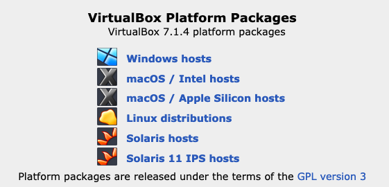
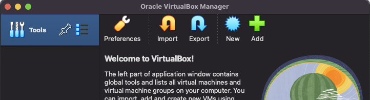
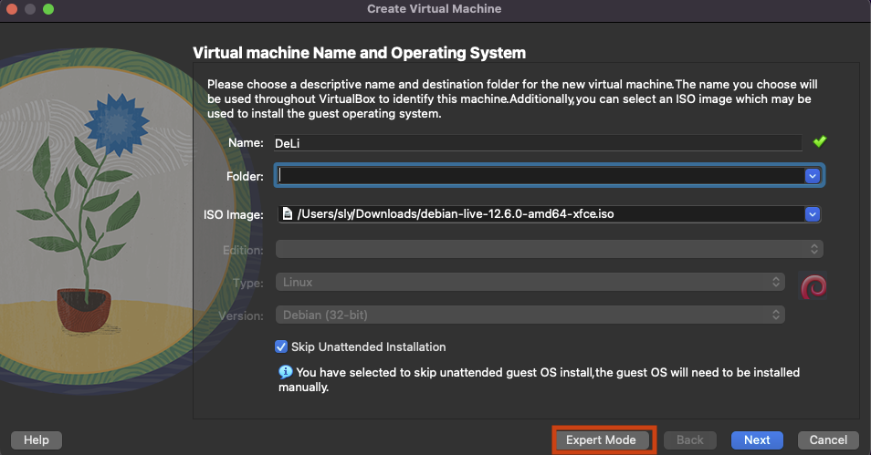
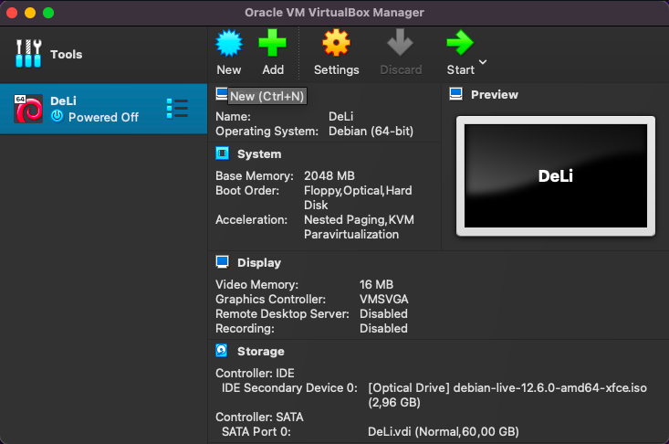
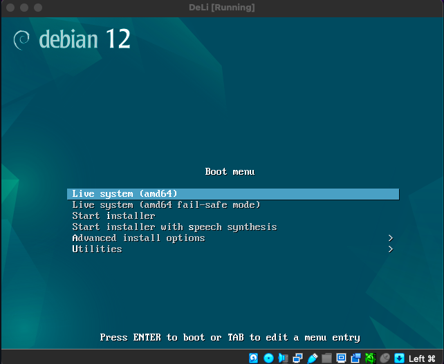
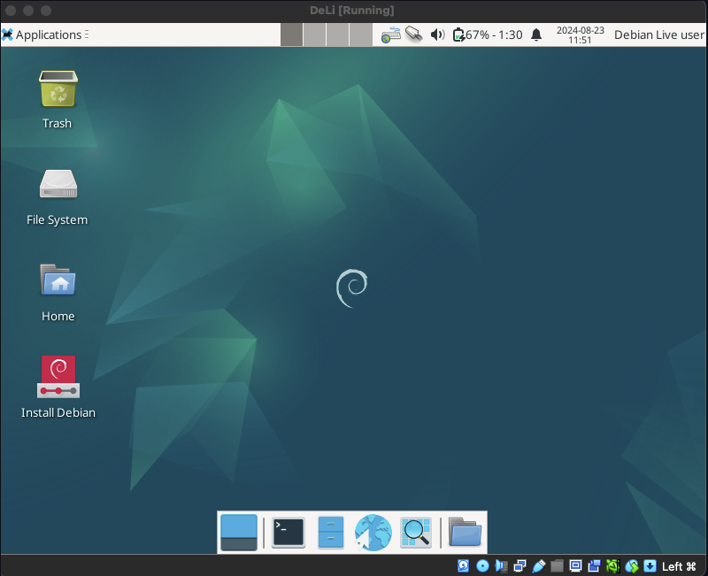
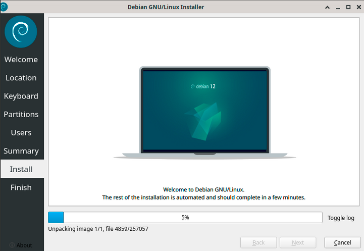

# Raportin kirjoittaminen & Virtuaalikoneen asennus 5.1.2025

- Raportti kirjoitetaan toimeenpiteestä jota ollaan suoritettu tietokoneella.
- Raportin tulos pitää olla sama, jos joku muu suorittaisi saman toimenpiteen mitä raportissa on selostettu.
- Raportin tulee olla täsmällinen, siinä pitää käydä ilmi mitä on tehty, miten se on tehty, millä se on tehty, sekä missä ja milloin. Olosuhteet voidaan ilmoittaa myös jos siitä on tarpeen.
- Raportin tulee olla helppolukuinen ja kirjoitettu huolellisesti.
- Raportin tulee välttää plagiointia, sepittämistä tai muuta epäasiallista tekstiä.
- Raportissa tulee olla lähdeviitteet, jos on esitetty muiden tahojen tekstiä, työtä, kuvaa tai muuta asiaa joka loukkaisi tekijänoikeuksia. [1]

## Free Software Foundation

Vapaa ohjelmisto. Tarkoittaa että henkilöillä ja tahoilla on oikeus sovelluksen tai ohjelmiston vapaata 
1. käyttöä, 
2. muokkaamista, 
3. alkuperäisen ohjelman jakamista 
4. alkuperäisen ohjelman jakaminen omien muokkausten jälkeen. 

[2]

## Laitteisto

- **MacBook Air INTEL**
    - MacOS Monterey 12.7.5
    - Intel Core i5
    - 8 Gt 1600 MHz DDR3
    - Intel HD Graphics 6000

- **VirtualBox 7**
    - Debian 12

## Asenna Linux virtuaalikoneeseen. 

**Käyttöjärjestelmä**

Debian Live images: https://cdimage.debian.org/debian-cd/current-live/amd64/iso-hybrid/

| Type | Name                                         | Date & Time         | Size |
|------|----------------------------------------------|----------------------|------|
| ISO  | **`debian-live-12.8.0-amd64-xfce.iso`**            | 2024-11-09 11:10     | 3.0G |
| TXT  | debian-live-12.8.0-amd64-xfce.iso.contents    | 2024-11-09 12:56     | 52K  |
| TXT  | debian-live-12.8.0-amd64-xfce.iso.log        | 2024-11-09 13:06     | 1.7M |
|      | debian-live-12.8.0-amd64-xfce.iso.packages   | 2024-11-09 12:33     | 65K  |
| TXT  | debian-live-12.8.0-amd64-xfce.log            | 2024-11-09 13:05     | 1.8M |

**Virtuaalikone**

VirtualBox: https://www.virtualbox.org/wiki/Downloads

Valitse mille alustalle haluat asentaa.

Avaa lataamasi VirtualBox ohjelma ja valitse `New`. Tämä luo uuden virtuaalikoneen

Anna virtuaalikoneelle nimi. `DeLi`

`Folder` on kansio mihin virtuaalikone tallennetaan. Oletuksena `~/user/VirtualBox VMs`

`ISO Image`, on tässä [Debian Live Image](https://cdimage.debian.org/debian-cd/current-live/amd64/iso-hybrid/) sivulta ladattu `-xfce.iso` tiedosto.

`Expert Mode` napin takaa voit tehdä lisää muokkauksia virtuaalikoneeseen, kuten tallennustila ja prosessorien resurssit.

Voit vaihtoehtoisesti täpätä `Skip Unattended Installation` ja painaa Next/seuraava ja jatkaa.

Uusi kone näkyy listalla. Oletusresurssit ovat 2 GB RAM ja 60 GB tallennustilaa.

Käynnistä kone valitsemalla kone ja painamalla Start.

Voit asentaa käyttöjärjestelmän heti, valitsemalla Start installer ...

... tai voit valita Live system ja tutkistella miltä käyttöjärjestelmä näyttää ensin.

Voit käyttää virtuaaliympäristöä jo. Avaa selain ja selaile esim. paikalliseen uutissivustoon, voit kokeilla terminaalia jne.

Voit asentaa käyttöjärjestelmän. Avaa työpöydällä oleva `Install Debian` tuplaklikkaamalla.

Tämä avaa ikkunan jossa voit muokata ensin asetuksia virtuaalikoneelle ja sen jälkeen aloittaa asennuksen.

`Launch Anyway`

---

Asetuksessa valitset tietokoneen sijainnin, kielen, näppäimistökielen ja kellonajan sekä päivämäärän

Käytä vahvaa salasanaa käyttäjätunnukselle.

## Lähteet

1. Karvinen, Tero. Raportin kirjoittaminen 4.6.2006. Luettavissa: https://terokarvinen.com/2006/raportin-kirjoittaminen-4/. Luettu: 21.8.2024.
2. GNU. What is Free Software s.a. Luettavissa: https://www.gnu.org/philosophy/free-sw.html. Luettu 24.8.2024