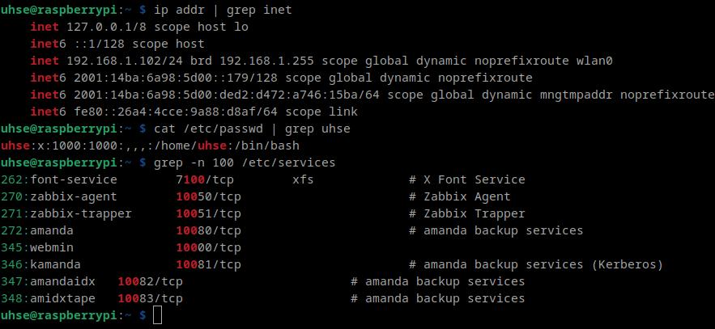
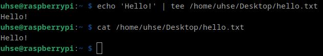
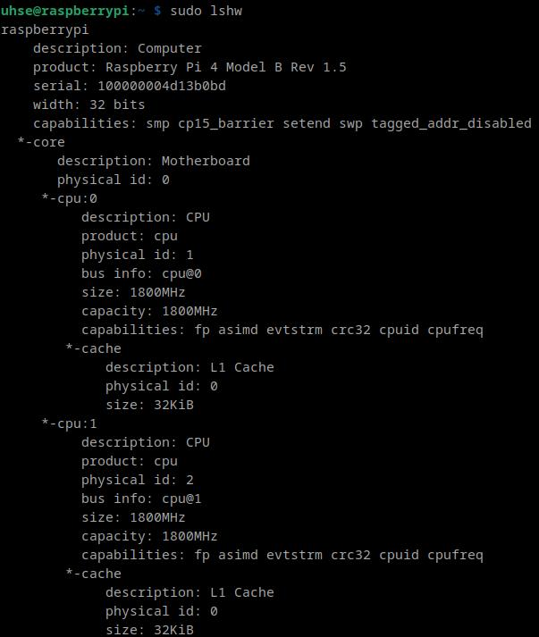
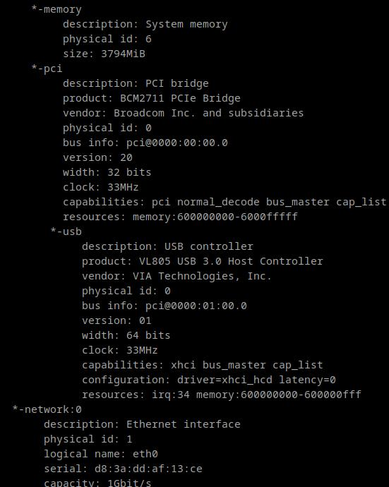
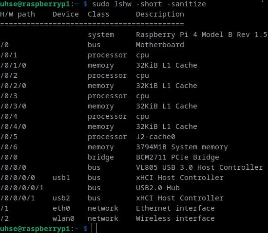
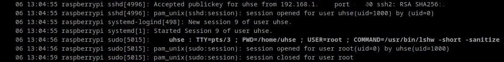
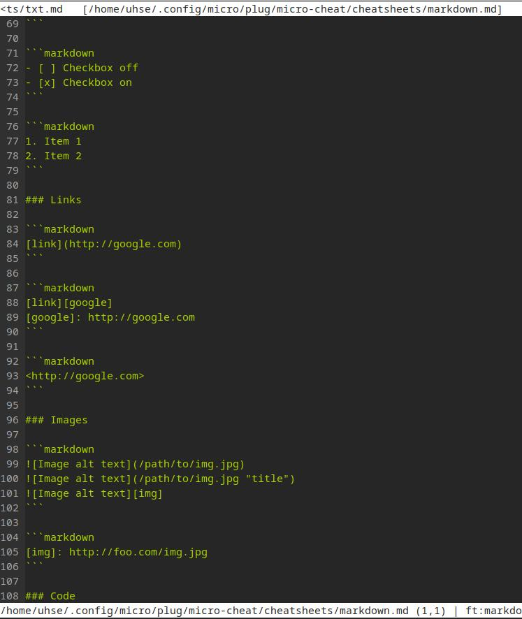

# Linux käyttö

[Command line basics revisited](https://terokarvinen.com/2020/command-line-basics-revisited/?fromSearch=command%20line%20basics%20revisited)

[1]

## Laitteisto

- **Raspberry Pi 4**
    - Raspberry pi OS, 4 GB
   

## Micro Tekstieditori

Avaa terminaali `ctrl+alt+t`

```bash
$ sudo apt-get update
$ sudo apt-get upgrade
$ sudo apt-get install micro -y
``` 


<em>kuva 1</em>


---
## apt install: Useampi ohjelma


<em>kuva 2</em>

"htop" which shows interactively running processes and usage of the resources in clear TUI.


<em>kuva 3</em>


"ncdu" that shows systems size in memory usage, also helps you find large files and folders.


<em>kuva 4</em>


"cowsay", is funny little program that creates figure of cow and inserts your text to it speechbuble.


<em>kuva 5</em>

## Hakemistot ja navigointi. File hierarchy system

/ Root directory. The starting point of the entire file system hierarchy. `root`
    
    ├── bin             Essential user command binaries (programs) that are required for system operation.
    ├── boot            Bootloader files (e.g., kernels, initial RAM disks). 
    ├── dev             Device files representing hardware and virtual devices.
    ├── etc             Configuration files specific to the system.
    └── home            User home directories. Each user has a subdirectory in `/home`.
    │       ├── user1
    │       ├── user2
    │       ├── ...
    ├── lib             Shared libraries required by system binaries.
    ├── media           Mount points for removable media (e.g., USB drives, CDs).
    │   ├── cdrom 
    │   └── usb
    ├── mnt             Temporary mount points for file systems.
    ├── opt             Optional software packages.
    ├── proc            Virtual file system providing information about processes and system 
    ├── root            Home directory for the root user.
    ├── run             Runtime data for processes since the system booted.
    ├── sbin            Essential system binaries (administrative commands).
    ├── srv             Data for services provided by the system (e.g., web servers).
    ├── sys             Virtual file system providing information about hardware.
    ├── tmp             Temporary files. Cleared on reboot.
    ├── usr             User binaries, libraries, documentation, and source code.
    │   ├── bin 
    │   ├── lib 
    │   ├── local 
    │   └── share 
    └── var             Variable data files (e.g., logs, spool files, databases).
        ├── cache 
        ├── log 
        ├── mail 
        ├── run 
        ├── spool 
        └── tmp

Käytä komentoja

```
ls      cd  
pwd     cat
less    grep
```

## man grep



<em>kuva 6</em>

## Pipe and tee

Voit kirjoittaa suoraan tiedostoon `echo` ja `tee`n avulla.

teksti Hello! tiedostoon hello.txt



<em>kuva 7</em>

## lshow

```bash
$ sudo apt update
$ sudo apt install lshw
$ man lshw
$ sudo lshw
```



<em>kuva 8</em>



<em>kuva 9</em>

`lshw` on työkalu jolla saa tietoa tietokoneen fyysisesta laitteistosta. Tietokone koostuu, keskusyksiköstä, keskusmuistista ja oheislaitteista.

Kuvassa 8 näkyy tietoa laitteesta Raspberry pi 4 Model B Rev 1.5 ja 32 bittinen käyttöjärjestelmä, sekä tietoa keskusyksiköstä (CPU).

Kuvassa 9 näkyy tietoa keskusmuistista, sekä PCI väylätyypistä. PCI väylätyypit ovat vähentyneet, seuraaja PCIE on suosittu. PCI/PCIE avulla tietokoneeseen voidaan yhdistää lisälaitteita, kuten esimerkiksi näytönohjain ja kovalevy.

Tietoa löydyy myös USB:stä sekä verkon konfiguraatiosta `*-network`

```bash
sudo lshw -short -sanitize
```

Lyhyempi ja siistimpi listaus laitteistosta.



<em>kuva 10</em>

## Lokitiedot

```bash
journalctl
```

Kuvassa 11 näkyy että  otin yhteyttä SSH:n avulla Raspberry tietokoneeseen, käyttäjän `uhse` terminaaliin ja sain yhteyden auki.

Myöhemmin äyttää että ajoin komennon `$ lshw -short -sanitize` roottina



<em>kuva 11</em>

## Plugin

Opettajan sivuilta [Command Palette, Cheatsheet, Run and Make - New Micro Editor Plugins](https://terokarvinen.com/get-started-micro-editor/)

```bash
$ sudo apt-get update
$ sudo apt-get -y install micro fzf pythonpy git exuberant-ctags
```

```bash
$ micro --plugin install jump
$ cd $HOME/.config/micro/plug/
$ git clone https://github.com/terokarvinen/palettero.git
$ git clone https://github.com/terokarvinen/micro-run.git
$ git clone https://github.com/terokarvinen/micro-cheat.git
$ cd $HOME
```

Näin sain asennettua muutaman pluginin micro editorille.

Alla näkyy [Teron](https://github.com/terokarvinen) cheatsheet microlle.



# Lähteet

1. https://terokarvinen.com/2020/command-line-basics-revisited/?fromSearch=command%20line%20basics%20revisited