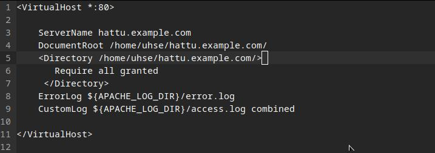

# Apache & Web server

1. The Apache Software Foundation 2023: Apache HTTP Server Version 2.4 Documentation: [Name-based Virtual Host Support](https://httpd.apache.org/docs/2.4/vhosts/name-based.html) [1]

2. Karvinen 2018: [Name Based Virtual Hosts on Apache – Multiple Websites to Single IP Address](https://terokarvinen.com/2018/04/10/name-based-virtual-hosts-on-apache-multiple-websites-to-single-ip-address/) [2]

3. HTTP Request Methods [w3schools](https://www.w3schools.com/tags/ref_httpmethods.asp) 
    - HTTP Methods
        - **GET**
        - POST
        - PUT
        - **HEAD**
        - DELETE
        - PATCH
        - OPTIONS
        - CONNECT
        - TRACE

[3]


## Laitteisto

- **Raspberry Pi 4**
    - Raspberry pi OS, 4 GB

## Apache

```bash
$ sudo apt update
$ sudo apt install apache2 -y
$ curl -I localhost
```


<em>kuva 1</em>

`curl -I localhost` kertoo lyhyesti tietoa sivusta, jos sivu on saatavilla `HTTP/1 200 OK`, muutoin tilakoodi on esim `300` alkuinen tai `400`, `500` alkuiset kertoo myös virheestä. Komento välittää myös tietoa palvelinohjelmasta `Server`, sivuston koosta `Content-Length` ja sisällön tyypistä `Content-Type`. 
- Tilakoodi, `200 OK`
- Päivämäärä jolloin otettu käyttöön, `Ma 6.1.2025`
- Palvelinohjelma, `Apache`
- Viimeksi muokattu, `Ma 6.1.2025`
- Sivuston koko, `10701` tavua
- Sivuston tyyppi 

Status Codes [Wikipedia](https://en.wikipedia.org/wiki/List_of_HTTP_status_codes)
 
[Wikipedia](https://fi.wikipedia.org/wiki/Luettelo_HTTP-tilakoodeista) [5]

```
    1xx informational response – the request was received, continuing process
    2xx successful – the request was successfully received, understood, and accepted
    3xx redirection – further action needs to be taken in order to complete the request
    4xx client error – the request contains bad syntax or cannot be fulfilled
    5xx server error – the server failed to fulfil an apparently valid request
```

[5]

## Lokitiedot


<em>kuva 2</em>

```bash
$ sudo tail /var/log/apache2/access.log
```

Rivi 1

`curl localhost`  näyttää koko sivun terminaalissa. `GET / HTTP/1.1` Huom. GET pyyntö

Rivit 2-4

Näyttää komennon `curl -I localhost` yhteydenotot. Näet `HEAD / HTTP/1.1` Eli tässä yhteydessä haetaan vain otsake. Esimerkki tulosteesta kuvassa 1. 

`GET` ja `HEAD` ero näkyy myös tulostuksen koossa. `GET` tuotti 10958 tavun kokoisen tulostuksen, ja `HEAD` tuotti vain 257 tavuisen tulostuksen

```bash
$ sudo tail /var/log/apache2/error.log
```

Näyttää lokitietoja, ensimmäinen rivi kertoo Apachen konfiguraatiosta ja jatkaa normaalia toimintaa.


Toinen rivi näyttää koodia `AH00094`, joka kertoo että Apache on käynnistetty/alustettu/initialized

## Uusi etusivu


`/var/www/html/index.html` on mihin Apachen oletussivu sijoitetaan asennuksessa.

---


Tehdään kansio `hattu-.example.com` käyttäjän hakemistoon. Muutetaan samalla tiedoston lukuoikeuksia, niin että kansioon pääsee ilman `sudo`a. 

```bash
$ chmod 755 hattu.example.com/index.html
```
---
`index.html` sisältö


---
Apachen konfiguraatiotiedosto. ***"DocumentRoot directive to show where in the filesystem the content for that host lives."*** [Using Name-based Virtual Hosts](https://httpd.apache.org/docs/2.4/mod/core.html#documentroot) [6]



---
Sivusto selaimella


## Lähteet
1. https://httpd.apache.org/docs/2.4/vhosts/name-based.html
2. https://www.w3schools.com/tags/ref_httpmethods.asp
3. https://terokarvinen.com/linux-palvelimet/
4. https://terokarvinen.com/2018/04/10/name-based-virtual-hosts-on-apache-multiple-websites-to-single-ip-address/
5. https://en.wikipedia.org/wiki/List_of_HTTP_status_codes
    - https://fi.wikipedia.org/wiki/Luettelo_HTTP-tilakoodeista
6. https://httpd.apache.org/docs/2.4/mod/core.html#documentroot

